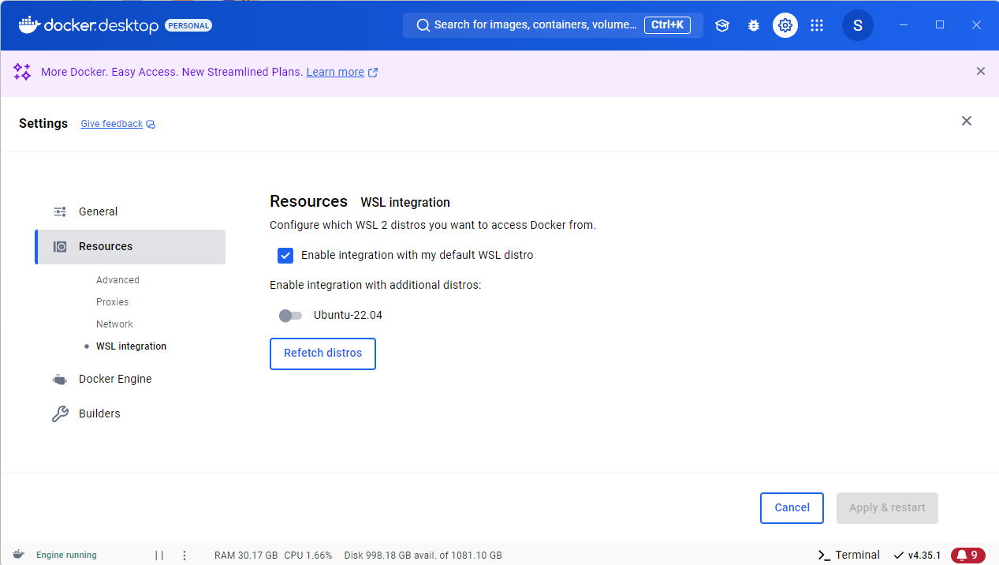

# WSLトラブルシューティング

WSLに関連するトラブルシューティングをまとめています．  

## 目次

- [外部ネットワークに接続できない(Docker Desktop for Windows)](#外部ネットワークに接続できないdocker-desktop-for-windows)
- [外部ネットワークに接続できない(Name Resolution Failure)](#外部ネットワークに接続できないname-resolution-failure)
- [シャットダウンできない](#シャットダウンできない)
- [容量が肥大化しCドライブを圧迫している](#容量が肥大化しcドライブを圧迫している)

[WSLの導入 に戻る](README.md)  
[HOME に戻る](../README.md)

## 外部ネットワークに接続できない(Docker Desktop for Windows)

ある時WSLで開いているUbuntuで外部ネットワークに接続できなくなりました．  
具体的には，以下のような外部ネットワークに接続して実行するコマンドが通らなくなりました．

```bash
sudo apt-get update
```

原因究明のため，[なんかWSL2がインターネットにつながらなくなったときの解決方法](https://qiita.com/kotauchisunsun/items/71fae973afa00ebb871a)などを参考に試してみましたが，  
全く解決できず，

```bash
ping 8.8.8.8
```

も通らないという状況でした．

結論から言うと，**Docker Desktop for Windowsが原因**でした．  
このアプリケーションを立ち上げた瞬間からネットワークにつながらなくなっていました．

解決方法としては，Docker Desktop for Windowsを立ち上げて，  
Setting＞Resources＞WSL integrationの順に押下して表示される，  
`Enable integration with my default WSL distro`のチェックを外し(=falseにし)，  
`Enable integration with additional distros:`において，使用するディストリビューションを選択することです．

  

というのも，私が普段使用していたのはdefaultのディストリビューションではないのです．  
Docker Desktopのこのdefault設定のせいでWSLが外部ネットワークに接続できなくなるのは驚きですが，  
このような場合はWSL integrationを普段使用するディストリビューションに割り当てることで解決が図れます．

[目次 に戻る](#目次)  
[WSLの導入 に戻る](README.md)  
[HOME に戻る](../README.md)  

## 外部ネットワークに接続できない(Name Resolution Failure)

上記のようにDocker Desktop for Windowsの設定変更により，

```bash
ping 8.8.8.8
```

が通るようになったのですが，今度は以下のコマンドが通らないという状況となりました．

```bash
ping google.com

# result
ping: google.com: Temporary failure in name resolution
```

ここからわかるのは，DNSによる名前解決ができていないということです．  
おそらく先の問題解決の際に`nameserver`を変更してしまったことが原因と考えられます．

この問題はroot権限で`/etc/resolv.conf`を編集することで解決できます．

```bash
sudo vi /etc/resolv.conf
```

で当該ファイルを開いた後に以下のように変更します．

```bash
nameserver 8.8.8.8
```

このIP `8.8.8.8`は`1.1.1.1`でもよいようです．

[目次 に戻る](#目次)  
[WSLの導入 に戻る](README.md)  
[HOME に戻る](../README.md)  

## シャットダウンできない

WSLを使用メモリ量がいっぱいになったままハングアップしてしまい，  
正攻法ではシャットダウンが受け付けないという状況に陥りました．  
この際はタスクマネージャーからもkillできないため，管理者権限でPowerShellを起動し，以下のコマンドでshutdownできます．

```bash
taskkill /f /im wslservice.exe
```

[目次 に戻る](#目次)  
[WSLの導入 に戻る](README.md)  
[HOME に戻る](../README.md)  

## 容量が肥大化しCドライブを圧迫している

Cドライブの整理をしていると，WSL(Ubuntu)の容量が82GBほどとなっておりdiskを圧迫していました．  
この容量を削減するためには，まずこのWSLのdisk(ext4.vhdx)がどこに存在するのかを調べる必要があります．  
そのディストリビューションがUbuntuである場合は，PowerShellにて  

```bash
Get-AppxPackage -Name "*Ubuntu*" | Select PackageFamilyName

# 実行結果
PackageFamilyName
-----------------
CanonicalGroupLimited.Ubuntu_63xq5k2mrtgbc
CanonicalGroupLimited.Ubuntu22.04LTS_63xq5k2mrtgbc
```

でPackageFamilyNameを取得します．  
ここで得られたFamilyNameから，該当するdiskは`C:\Users\<user_name>\AppData\Local\Packages\CanonicalGroupLimited.Ubuntu22.04LTS_63xq5k2mrtgbc\LocalState`配下に存在することがわかります．  
実際に該当ディレクトリ配下をエクスプローラーなどで確認すると`ext4.vhdx`の存在を確認できると思います．  

ここからこのdiskを圧縮していきます．  
この方法は大きく2つ存在します，  

### 1つ目：Hyper-Vを用いた方法(Windows Pro/Enterpriseの場合)

Windows Pro/Enterpriseで使用できるHyper-Vのコマンドを使用した最適化です．  
(該当しない場合は[2つ目の方法](#2つ目diskpartを用いた方法)を参照ください．)  
この場合，事前にHyper-V機能の有効化が必要です．  

---

#### Hyper-V機能の有効化

Windowsの機能の有効化または無効化を開く．  
コントロールパネル -> プログラム -> Windowsの機能の有効化または無効化  

下記2点の機能にチェックを入れてOKボタンをクリック．  
Hyper-V -> Hyper-V プラットフォーム -> Hyper-V サービス  
Hyper-V -> Hyper-V 管理ツール -> Windows PowerShell 用 Hyper-V モジュール  

---

まずPowerShellを管理者権限で開き，WSLを終了します．　　
Docker Desktopを使用している場合はタスクバーより終了してからWSLの終了を行ってください．　　

```bash
# WSLの終了
wsl --shutdown
# WSLの確認
wsl -l -v
```

次に最適化コマンドを実行します．  

```bash
optimize-vhd -Path "C:\Users\<user_name>\AppData\Local\Packages\CanonicalGroupLimited.Ubuntu22.04LTS_63xq5k2mrtgbc\LocalState\ext4.vhdx" -Mode Full
```

この操作が完了した後，ext4.vhdxの容量が減っていることが確認できると思います．

### 2つ目：diskpartを用いた方法

こちらの方法はWindows HomeなどHyper-Vが使用できない場合にも有効な方法です．  
Windows標準コマンドであるdiskpartを使用します．  
先ほど同様PowerShellを管理者権限で実行し，WSLを終了します．  

その後，diskpartを起動します．  

```bash
diskpart

# 実行結果
Microsoft DiskPart バージョン 10.0.19041.964

Copyright (C) Microsoft Corporation.
コンピューター: XXXX

DISKPART>
```

次に最適化対象のファイルを設定します．  

```bash
select vdisk file='C:\Users\<user_name>\AppData\Local\Packages\CanonicalGroupLimited.Ubuntu22.04LTS_63xq5k2mrtgbc\LocalState\ext4.vhdx'

# 実行結果
DiskPart により、仮想ディスク ファイルが選択されました。
```

このext4.vhdxのパスは完全装飾パスである必要があることに注意してください．  
続いて，.vhdxファイルを読み取り専用としてアタッチします．  

```bash
attach vdisk readonly

# 実行結果
  100% 完了しました

DiskPart により、仮想ディスク ファイルがアタッチされました。
```

次に最適化を実行します．  

```bash
compact vdisk

# 実行結果
  100% 完了しました

DiskPart により、仮想ディスク ファイルは正常に圧縮されました。
```

この最適化中はファイルが破損する可能性があるので，絶対に`ctrl+c`や`ctrl+z`などで中断しないようにしてください．  
最後にDISKPARTを終了して完了です．  

```bash
# .vhdxファイルをデタッチ
detach vdisk

# diskpartの終了
exit
```

この操作が完了した後，ext4.vhdxの容量が減っていることが確認できれば，完了です．

[目次 に戻る](#目次)  
[WSLの導入 に戻る](README.md)  
[HOME に戻る](../README.md)  
